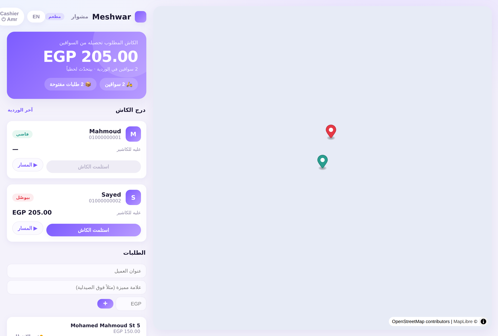
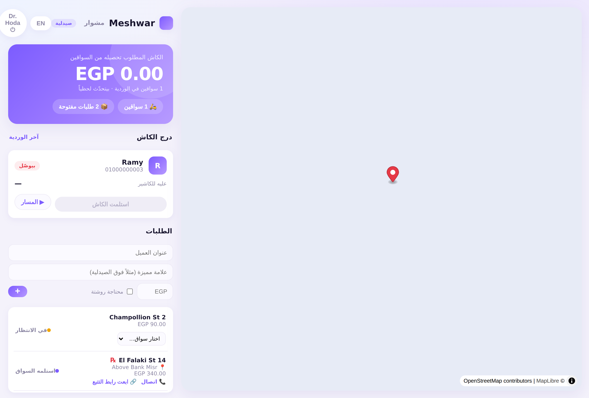
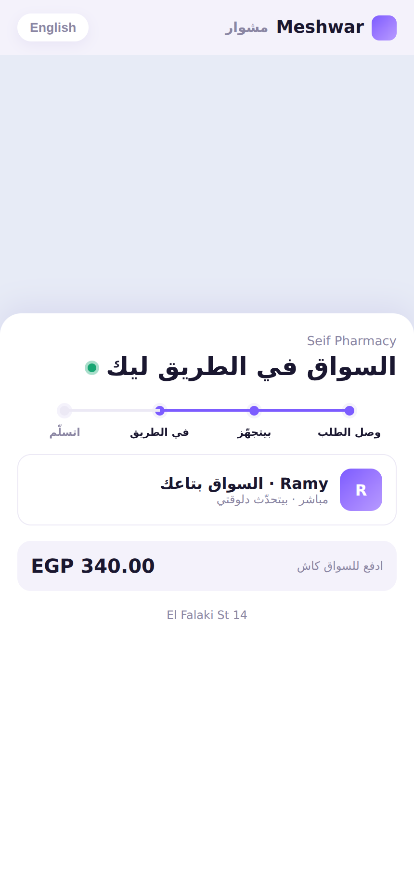
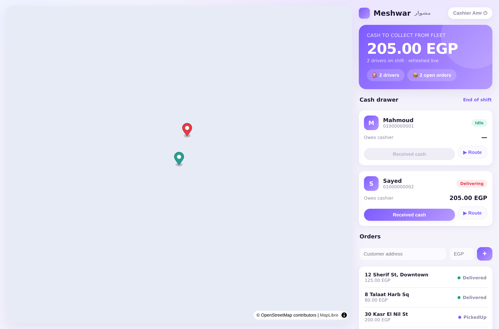
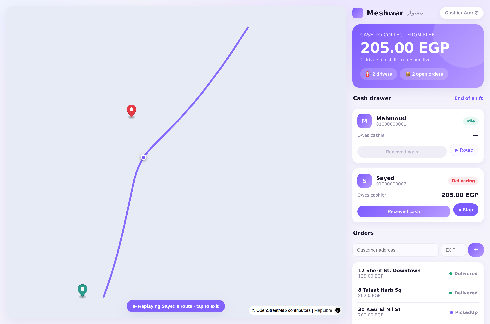
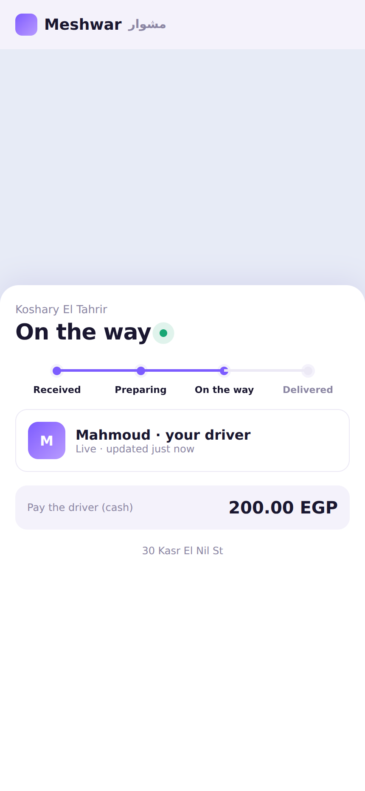

# Meshwar · مشوار — Driver Tracking SaaS

> *"Every delivery is a **meshwar**."* — hardware-free, phone-GPS live tracking
> + Cash-on-Delivery (COD) reconciliation for independent restaurants and
> takeaway chains running their own private delivery fleets in Egypt.

**Two apps, one system:** a battery-proof Flutter **driver app**, and a React
**manager/cashier dashboard** — talking to one lean Node + PostgreSQL backend.

**Built for Egypt's small merchants.** Multi-vertical by design — restaurants,
takeaways, pharmacies (with prescription flags), groceries, mini-markets, the
street **koshk (كشك)**, and a catch-all store. Fully **bilingual: Egyptian
Arabic (colloquial, RTL) + English**, with a one-tap language toggle across the
dashboard, driver app, and customer tracking page. Landmark-based addressing,
one-tap **Call**/WhatsApp, and COD reconciliation reflect how deliveries
actually work here — see [`docs/EGYPT-MARKET.md`](docs/EGYPT-MARKET.md).

| Dashboard — Egyptian Arabic (RTL) | Pharmacy vertical (℞ + prescription) | Customer tracking (Arabic) |
|---|---|---|
|  |  |  |

## Screenshots

The dashboard running against the real backend (Postgres + WebSocket). Street
tiles need outbound network; the live driver pins, cash drawer, and route
replay are driven by seeded backend data.

| Live fleet + cash drawer | Route replay (from `location_logs`) |
|---|---|
|  |  |

Customer-facing live tracking link (`/t/:token`, no login — shareable by SMS):



## Repo layout

```
.
├── docs/
│   └── ARCHITECTURE.md          System architecture + WS-vs-Firebase decision
├── backend/                     Node + WebSocket + PostgreSQL (the whole backend)
│   ├── prisma/schema.prisma     PostgreSQL schema (Prisma)
│   ├── sql/schema.sql           Same schema as raw SQL
│   └── src/
│       ├── server.ts            One process = REST API + WS tracking
│       ├── ws/tracking.ts       Batched location ingest + dashboard fan-out
│       ├── routes/              Auth + order lifecycle (transactional)
│       ├── services/cashDrawer.ts   COD reconciliation (the money logic)
│       └── db/seed.ts           Demo restaurant + drivers + orders
├── dashboard/                   React + Vite + MapLibre manager dashboard
│   └── src/                     Live map, order assign, cash-drawer settle
├── mobile/flutter/              Driver app w/ background foreground service
│   └── lib/
│       ├── screens/             Login + home (shift toggle, cash hero)
│       ├── services/location_service.dart   The battery-proof tracking core
│       └── theme.dart           Shared Meshwar visual identity
├── firestore/                   Alternative if you skip the SQL backend
└── docker-compose.yml           One-command Postgres + backend
```

## The four answers, in one line each

1. **Real-time strategy** — one Node process holds a WebSocket per driver
   (batched frames every 20s) and fans the latest point out to dashboard rooms.
   Chosen over Firestore because per-operation billing is wrong for
   high-frequency location writes, and SQL transactions are right for cash. See
   `docs/ARCHITECTURE.md`.
2. **Schema** — `restaurants · drivers · orders · location_logs` with money in
   integer piastres and denormalized `current_lat/lng` hot columns. See
   `backend/prisma/schema.prisma` / `backend/sql/schema.sql`.
3. **Background tracking** — Android **foreground service** with a visible
   notification (`flutter_background_service`) so budget OEM phones can't freeze
   it; batched, movement-filtered GPS with an offline queue. See
   `mobile/flutter/lib/services/location_service.dart` and the manifest snippet.
4. **Cash drawer** — aggregate each driver's `Delivered && !settled` orders;
   settle atomically under a row lock. See
   `backend/src/services/cashDrawer.ts`.

## Local quick start

**Option A — one command (Docker):**
```bash
docker compose up --build          # Postgres + backend on :8080
docker compose exec backend npx tsx src/db/seed.ts   # demo data
```

**Option B — manual backend:**
```bash
cd backend
npm install
# set DATABASE_URL + JWT_SECRET in .env
npx prisma migrate dev --name init
npm run seed          # demo restaurant + drivers + orders
npm run dev           # REST + WS on :8080
```

**Dashboard:**
```bash
cd dashboard
npm install
npm run dev           # http://localhost:5173
```

**Demo login:** `manager@demo.eg` / `password123`
(drivers: `01000000001` / `1234`, `01000000002` / `1234`)

### UI / design
The dashboard and driver app share one fintech-inspired visual language
(soft lilac gradients, rounded cards, a bold gradient balance hero, pill
buttons, status chips). The fleet's **total COD cash to collect** is the hero
"balance" card; each driver is a holdings-style row with a *Received cash*
settle button. See `dashboard/src/index.css` and `mobile/flutter/lib/theme.dart`.

## Recommended lean hosting (flat ~$5–15/mo)

- **Backend + Postgres:** Fly.io, Railway, Render, or a Hetzner CX small VM.
- **Dashboard:** any static host (Vercel/Netlify/Cloudflare Pages).
- **Maps:** the dashboard can use free-tier MapLibre + OpenStreetMap tiles to
  avoid Google Maps billing; drivers use their own installed Google Maps for
  turn-by-turn (deep link, no API cost to you).

> This is an architectural blueprint with production-grade patterns and runnable
> templates — wire in real auth, migrations, and error handling before shipping.
